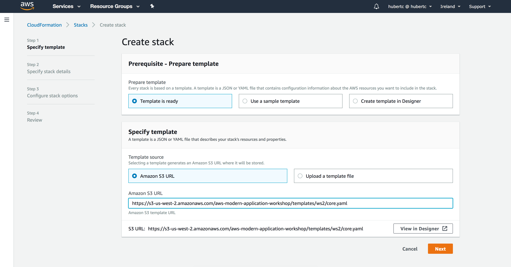
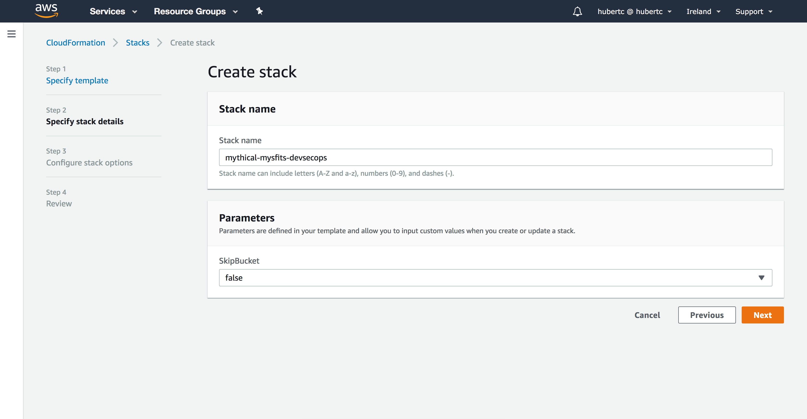
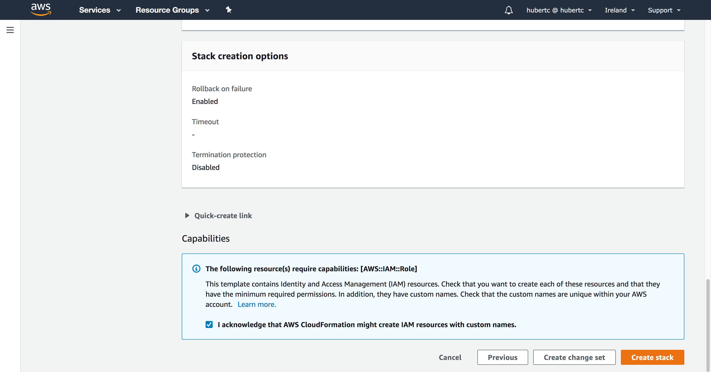
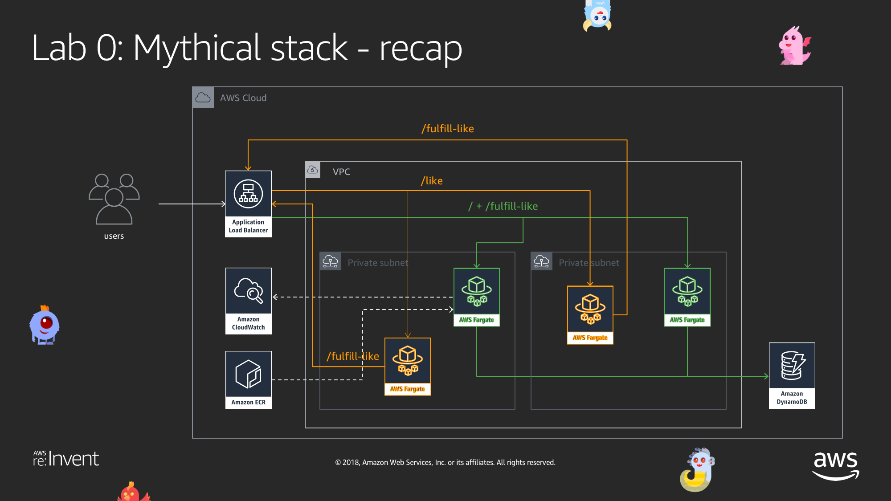
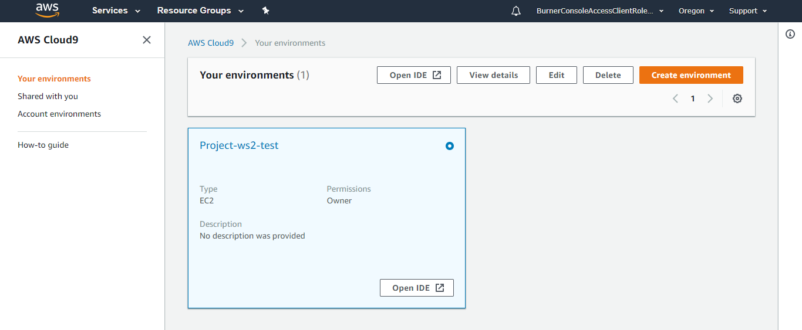
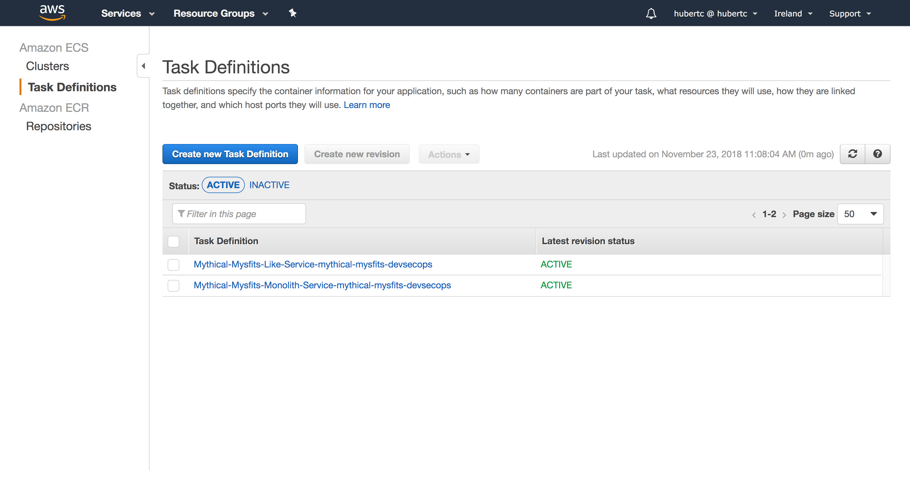
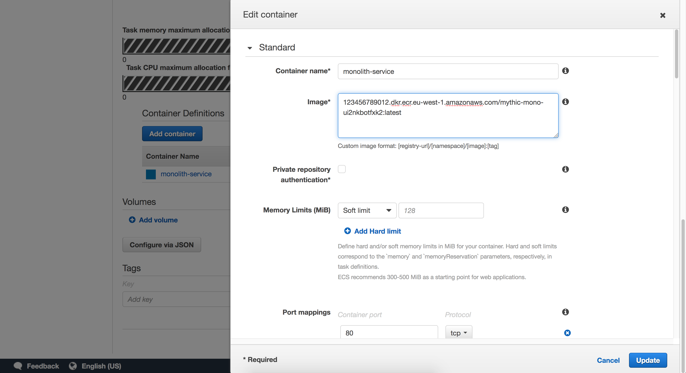

# Mythical Mysfits: DevSecOps with Docker and AWS Fargate

## Lab 0 - Deploy Existing Mythical Stack

In this lab, we are going to create the core infrastructure for the rest of the workshop and get familiar with the general environment.

## Table of Contents

Here's what you'll be doing:

* [Deploy Mythical CloudFormation Stack](#deploy-mythical-cloudformation-stack)
* [Familiarize Yourself with the Mythical Workshop Environment](#familiarize-yourself-with-the-workshop-environment)
* [Configure Cloud 9 Mythical Working Environment](#configure-cloud9-working-environment)
* [Choose Your Mythical Path](#stop-pay-attention-here-because-it-matters)
* [Crash Course/Refresher of CON214](#crash-courserefresher-on-workshop-1-con214-monolith-to-microservice-with-docker-and-aws-fargate)

### Deploy Mythical CloudFormation Stack

1\. Select an AWS Region

Log into the AWS Management Console and select an [AWS region](http://docs.aws.amazon.com/AWSEC2/latest/UserGuide/using-regions-availability-zones.html).  

The region dropdown is in the upper right hand corner of the console to the left of the Support dropdown menu.  For this workshop, choose either **US West (Oregon)**, **US East (Ohio)**, **EU (Ireland)** or **Asia Pacific (Singapore)**.  Workshop administrators will typically indicate which region you should use.

2\. Launch CloudFormation Stack to create core workshop infrastructure

Click on one of the **Deploy to AWS** icons below to region to stand up the core workshop infrastructure.

Region | Launch Template
------------ | -------------  
**Oregon** (us-west-2) |   
**Ohio** (us-east-2) |   
**Ireland** (eu-west-1) |   
**Singapore** (ap-southeast-1) |  

The links above will bring you to the AWS CloudFormation console with the **Specify an Amazon S3 template URL** field populated and radio button selected. Just click **Next**. If you do not have this populated, please click the link above.

3\. Specify stack details

On the Create Stack page, the stack name should automatically be populated. If you're running multiple workshop environments in the same account, use a different stack name.

<!--There is a parameter **SkipBucket** but you don't need to change anything.-->

<!--- **SkipBucket** - *If you want to skip the creation of the Mythical Mysfits S3 website bucket*-->

For the parameter **ClairDBPassword** you need to follow the Postgres minimum password requirements:

<pre><b>
Master Password must be at least eight characters long, as in "mypassword". Can be any printable ASCII character except "/", "", or "@".
</b></pre>

Click **Next** to continue.

4\. Configure stack options

No changes or inputs are required on the Configure stack options page.  Click **Next** to move on to the Review page.

5\. Review

On the Review page, take a look at all the parameters and make sure they're accurate. Check the box next to **I acknowledge that AWS CloudFormation might create IAM resources with custom names.** If you do not check this box, the stack creation will fail. As part of the cleanup, CloudFormation will remove the IAM Roles for you.

Click **Create** to launch the CloudFormation stack.

Here is what the templates are launching:

The CloudFormation template will launch the following:
* VPC with public subnets, routes and Internet Gateway
* An ECS cluster with no EC2 resources because we're using Fargate
* ECR repositories for your container images
* Application Load Balancer to front all your services
* Cloud9 Development Environment
* A DynamoDB table to store your mysfits and their data

## Checkpoint:

The CloudFormation stack will take a few minutes to launch.  Periodically check on the stack creation process in the CloudFormation Dashboard.  Your stack should show status **CREATE\_COMPLETE** in roughly 5-10 minutes. If you select box next to your stack and click on the **Events** tab, you can see what steps it's on.  

If there was an [error](http://docs.aws.amazon.com/AWSCloudFormation/latest/UserGuide/troubleshooting.html#troubleshooting-errors) during the stack creation process, CloudFormation will rollback and terminate. You can investigate and troubleshoot by looking in the Events tab.  Any errors encountered during stack creation will appear in the event stream as a failure.

### Familiarize yourself with the workshop environment

1\. Access your AWS Cloud9 Development Environment

In the AWS Management Console, go to the [Cloud9 Dashboard](https://console.aws.amazon.com/cloud9/home) and find your environment which should be prefixed with the name of the CloudFormation stack you created earlier, in our case mythical-mysfits-devsecops. You can also find the name of your environment in the CloudFormation outputs as Cloud9Env. Click **Open IDE**.

2\. Familiarize yourself with the Cloud9 Environment

On the left pane (Blue), any files downloaded to your environment will appear here in the file tree. In the middle (Red) pane, any documents you open will show up here. Test this out by double clicking on README.md in the left pane and edit the file by adding some arbitrary text. Then save it by clicking **File** and **Save**. Keyboard shortcuts will work as well.

On the bottom, you will see a bash shell (Yellow). For the remainder of the lab, use this shell to enter all commands.  You can also customize your Cloud9 environment by changing themes, moving panes around, etc. As an example, you can change the theme from light to dark by following the instructions [here](https://docs.aws.amazon.com/cloud9/latest/user-guide/settings-theme.html).

### Configure Cloud9 Working Environment

1\. Configure Git credentials

Since most of the labs are going to be using git, let's set up our permissions now. There are a number of ways to authenticate with git repositories, and specifically CodeCommit in this case, but for the sake of simplicity, we'll use the CodeCommit credential helper here. Enter the following commands to configure git to access CodeCommit. 

<pre>
$ git config --global credential.helper "cache --timeout=7200"
$ git config --global user.email "<b><i>REPLACEWITHYOUREMAIL</i></b>"
$ git config --global user.name "<b><i>REPLACEWITHYOURNAME</i></b>"
$ git config --global credential.helper '!aws codecommit credential-helper $@'
$ git config --global credential.UseHttpPath true
</pre>

2\. Clone Workshop Repo

There are a number of files and startup scripts we have pre-created for you. They're all in the main repo that you're using, so we'll clone that locally. Run this:

<pre>
$ git clone https://github.com/aws-samples/amazon-ecs-mythicalmysfits-workshop.git
</pre>

3\. Bootstrap

There are a number of files that need to be created in order for your services to run later, so let's create them now.

<pre>
$ cd ~/environment/amazon-ecs-mythicalmysfits-workshop/workshop-2/
$ script/setup
</pre>

# STOP! Pay attention here because it matters! Choose Your Path.

<b>Click here</b> if you are already attended CON214 or are familiar with Docker, Fargate, and AWS in general, we'll give you instructions on how to run the bootstrap script that will get you to the start of Lab 1.

<pre>
$ cd ~/environment/amazon-ecs-mythicalmysfits-workshop/workshop-2/
$ script/setup_ws1_end
</pre>

You should now have 2 Fargate services running in ECS - one for the Monolith service and one for the Like service. These are both sitting behind an ALB.

One last thing before you move on. Go to the CloudFormation Outputs section of your stack and get the **S3WebsiteEndpoint**. It is an HTTP link. Copy and paste it into your browser window and bookmark it or put it in a note. It should already be working. If you see a bunch of Mysfits, it's working. Otherwise, it's not.

# Checkpoint

You made it to the end of Lab 0. You should now have two running services hooked into an ALB. If you visit the S3 static website bucket that was created as part of the bootstrap, it should be working already and you should see a bunch of Mythical Mysfits. Now you're ready to move on to Lab 1 to start your journey to DevSecOps!

[Proceed to Lab 1](../Lab-1)

<b>Click here</b> if you want a <b>refresher</b> or a quick crash course on Docker, Fargate, and AWS in general. You'll do a few of the steps from CON214 to get you to the start of Lab 1.

### Crash Course/Refresher on Workshop 1 (CON214: Monolith to Microservice with Docker and AWS Fargate)

1\. Build the monolith docker image and test it

In order for us to use a Docker image, we have to create it first. We'll do it manually here but don't worry, the whole point is to automate all this away. 

<pre>
$ cd ~/environment/amazon-ecs-mythicalmysfits-workshop/workshop-2/app/monolith-service
$ docker build -t monolith-service .
</pre>

Run the docker container and test the adoption agency platform running as a container to make sure it responds

Use the [docker run](https://docs.docker.com/engine/reference/run/) command to run your image; the -p flag is used to map the host listening port to the container listening port. Note that "Table-REPLACEME_STACKNAME" will need to be updated; replace the ***REPLACEME_STACKNAME*** portion with the name you entered when you created the CloudFormation stack.

<pre>
$ docker run -p 8000:80 -e AWS_DEFAULT_REGION=<b><i>REPLACEME_REGION</i></b> -e DDB_TABLE_NAME=<b><i>Table-REPLACEME_STACKNAME</i></b> monolith-service
</pre>

Following our naming conventions, my command would be:
<pre>
$ docker run -p 8080:80 -e AWS_DEFAULT_REGION=ap-southeast-1 -e DDB_TABLE_NAME=Table-mythical-mysfits-devsecops monolith-service
 * Running on http://0.0.0.0:80/ (Press CTRL+C to quit)
</pre>

Press **Ctrl + C to exit**

2\. Push to the monolith-service ECR Repository

In order to pull an image to use it, we have to put it somewhere. Similarly to how we use Git and centralized source control systems like GitHub, we'll use Amazon EC2 Container Registry (ECR) to store our images. Let's start by getting the ECR repository that we will be pushing to. Use the CLI to run `aws ecr describe-repositories` and note down both of the **repositoryUri** values for the ECR repositories that were created for you. The **repositoryName** should have the words mono or like in them. Don't worry that the name has a bunch of random characters in it. That's just CloudFormation making uniquely named resources for you.

<pre>
$ aws ecr describe-repositories
{
    "repositories": [
        {
            "registryId": "123456789012", 
            "repositoryName": "mythic-mono-ui2nkbotfxk2", 
            "repositoryArn": "arn:aws:ecr:eu-west-1:123456789012:repository/mythic-mono-ui2nkbotfxk2", 
            "createdAt": 1542995670.0, 
            "repositoryUri": "123456789012.dkr.ecr.eu-west-1.amazonaws.com/mythic-mono-ui2nkbotfxk2"
        }, 
        {
            "registryId": "123456789012", 
            "repositoryName": "mythic-like-qhe5ji30css2", 
            "repositoryArn": "arn:aws:ecr:eu-west-1:123456789012:repository/mythic-like-qhe5ji30css2", 
            "createdAt": 1542995670.0, 
            "repositoryUri": "123456789012.dkr.ecr.eu-west-1.amazonaws.com/mythic-like-qhe5ji30css2"
        }
    ]
}
</pre>

Now that we have the repository URIs, we can tag and push the images up to ECR for later use. Here we are pushing the monolith-service to the repository with the word `mono` in it we got from above. 

<pre>
$ $(aws ecr get-login --no-include-email --region ap-southeast-1)
$ docker tag monolith-service:latest <b><i>REPLACEME_ECR_REPOSITORY_URI_FOR_mythic-mono</b></i>:latest
$ docker push <b><i>REPLACEME_ECR_REPOSITORY_URI_FOR_mythic-mono</b></i>:latest

The push refers to repository [123456789012.dkr.ecr.ap-southeast-1.amazonaws.com/mythic-mono-uji1fb14urlq]
a09105a1d2ce: Pushed 
b0be10c9aaa2: Pushed 
5a458948ccaa: Pushed 
2fc1a26ddb10: Pushed 
3178611d3d5f: Pushed 
76c033092e10: Pushed 
2146d867acf3: Pushed 
ae1f631f14b7: Pushed 
102645f1cf72: Pushed 
latest: digest: sha256:5d985802219c5a92ea097d414858d962c125c1ff46cfc70edcdf7f05ac964f62 size: 2206
</pre>

When you issue the push command, Docker pushes the layers up to ECR, and if you refresh the monolith-service ECR repository page, you'll see an image indicating the latest version.  

2\. Build the like docker image and push to ECR.

We already have the repository URIs so let's build the like-service:

<pre>
$ cd ~/environment/amazon-ecs-mythicalmysfits-workshop/workshop-2/app/like-service
$ docker build -t like-service .
</pre>

*Note: Did you notice that the build time was significantly shorter when building the like-service? That's because most of the layers were already cached*

<pre>
$ docker tag like-service:latest <b><i>REPLACEME_ECR_REPOSITORY_URI_FOR_mythic-like</b></i>:latest
$ docker push <b><i>REPLACEME_ECR_REPOSITORY_URI_FOR_mythic-like</b></i>:latest
</pre>

3\. Look at the task definition for the monolith-service

Task definitions are an integral part of Fargate. It tells the Fargate service what to run, from how much memory to which actual Docker image to run. 

As part of the core infrastructure stack, we've already created task definitions for you, but let's take a look at them to understand what gets updated on a deployment. In the AWS Management Console, navigate to [Task Definitions](https://console.aws.amazon.com/ecs/home#/taskDefinitions) in the ECS dashboard. Check the checkbox next to the monolith-service task definition. It should be named something like Mythical-Mysfits-Monolith-mythical-mysfits-devsecops. Then click on **Create New Revision**

Scroll down to Container Definitions where you should see where we have pre-defined a monolith-service container. Click on **monolith-service** to see details. Normally, this is where you'd modify the container image to change what you want to deploy to Fargate. However, since we've already pre-populated this, you're all set.

Cancel out of everything until you're back to the **Task Definition** page.

4\. Create Fargate services

First, we get the task definition names that we want to use. You saw them in the console earlier, but let's get them from the CLI:

<pre>
$ aws ecs list-task-definitions
{
    "taskDefinitionArns": [
        "arn:aws:ecs:eu-west-1:123456789012:task-definition/Mythical-Mysfits-Like-Service-mythical-mysfits-devsecops:1", 
        "arn:aws:ecs:eu-west-1:123456789012:task-definition/Mythical-Mysfits-Monolith-Service-mythical-mysfits-devsecops:1"
    ]
}
</pre>

Next up we need to create the Fargate services for the monolith service and the like service. We're using AWS CLI skeletons that we've updated to include the output values from the CloudFormation stack. The only thing you have to do is pass in the task definitions you noted down earlier. Run the following commands from your Cloud9 IDE, substituting in the task definitions for the ones you just listed. Make sure to include the number at the very end.

<pre>
$ cd ~/environment/amazon-ecs-mythicalmysfits-workshop/workshop-2/Lab-0
$ aws ecs create-service --cli-input-json file://monolith-service.json --task-definition REPLACE_ME_MONOLITH_TASK_DEFINITION
$ aws ecs create-service --cli-input-json file://like-service.json --task-definition REPLACE_ME_LIKE_TASK_DEFINITION
</pre>

In my case, things looked like this:

<pre>
aws ecs create-service --cli-input-json file://monolith-service.json --task-definition Mythical-Mysfits-Monolith-Service-mythical-mysfits-devsecops:1
aws ecs create-service --cli-input-json file://like-service.json --task-definition Mythical-Mysfits-Like-Service-mythical-mysfits-devsecops:1
</pre>

If successful, a large blob of JSON describing your new service will appear.

5\. Visit the Mythical Mysfits Homepage

Finally, let's look at what you've set up. The Mythical Mysfits adoption homepage is where you will be able to view all sorts of information about the Mythical Mysfits. To find out how to get there, go to the CloudFormation outputs section for your CloudFormation stack. Look for an output named **S3WebsiteEndpoint**. It is an HTTP link. Copy and paste it into your browser window and bookmark it or put it in a note. It should already be working. If you see a bunch of Mysfits, it's working. Otherwise, it's not.

# Checkpoint

You made it to the end of Lab 0. In one way or another, you should now have two running services hooked into an ALB. If you visit the S3 static website bucket that was created as part of the bootstrap, it should be working already and you should see a bunch of Mythical Mysfits. Now you're ready to move on to Lab 1 to start your journey to DevSecOps!

[Proceed to Lab 1](../Lab-1)

# The End?

This is the end of Lab 0, but if you're reading this, you may have gone too far. Make sure you click on the hidden dialogues right above this section.

