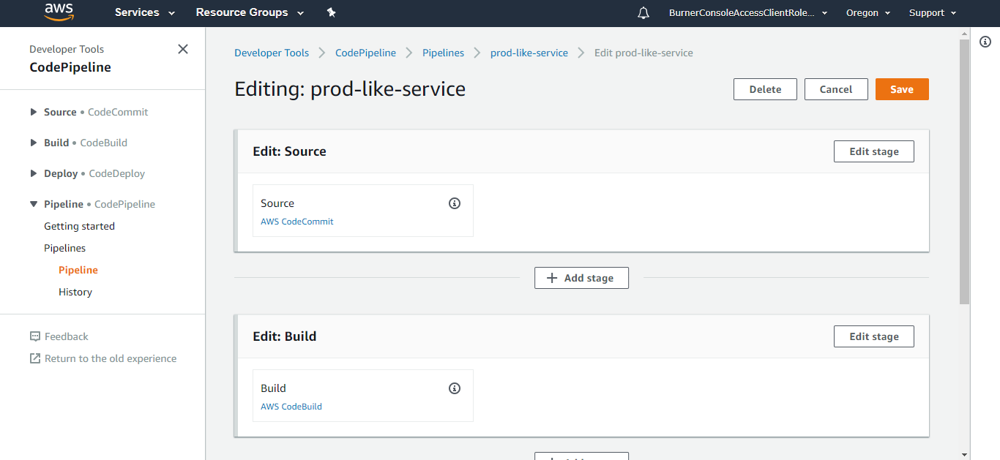
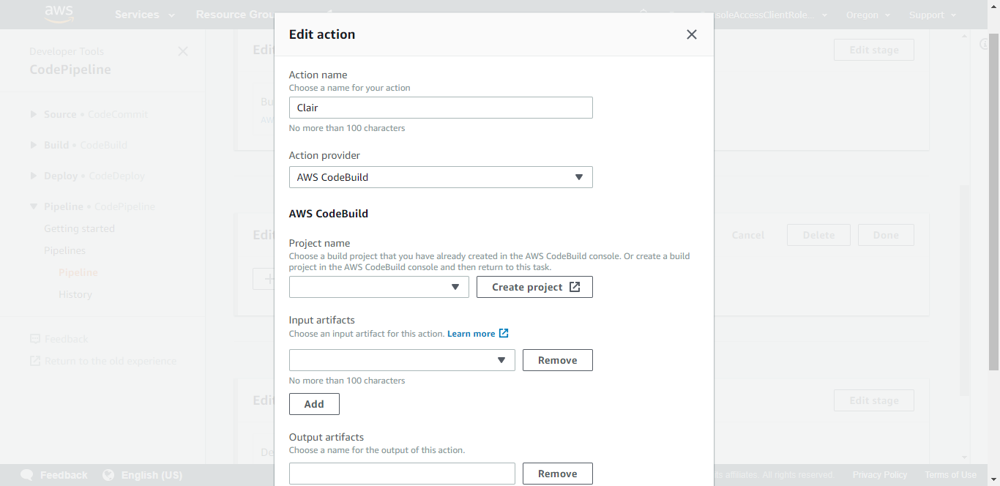
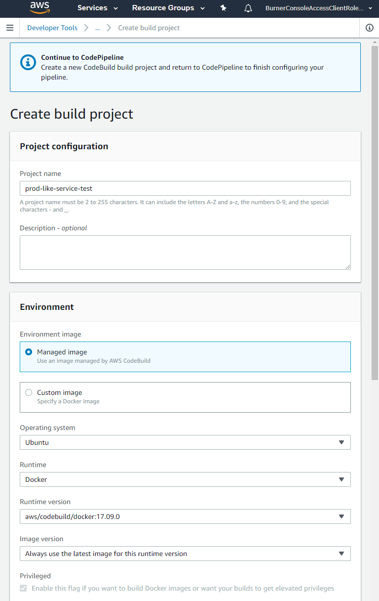
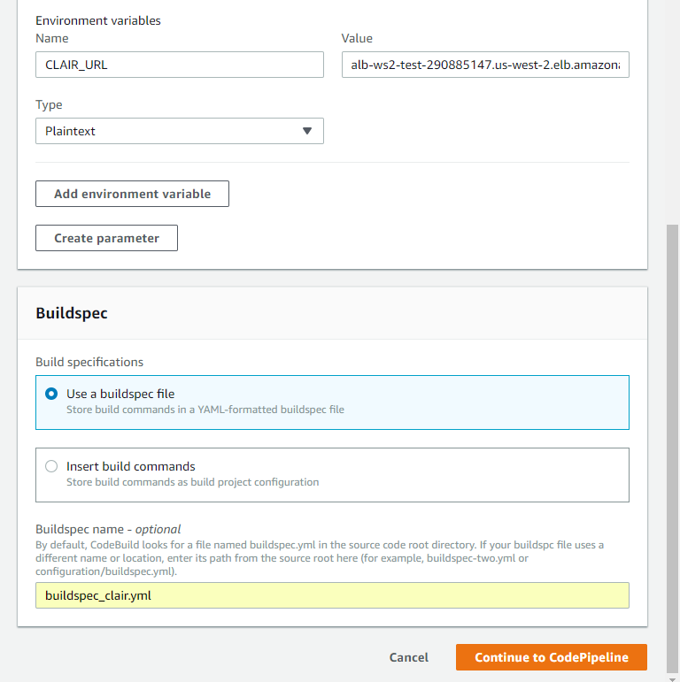
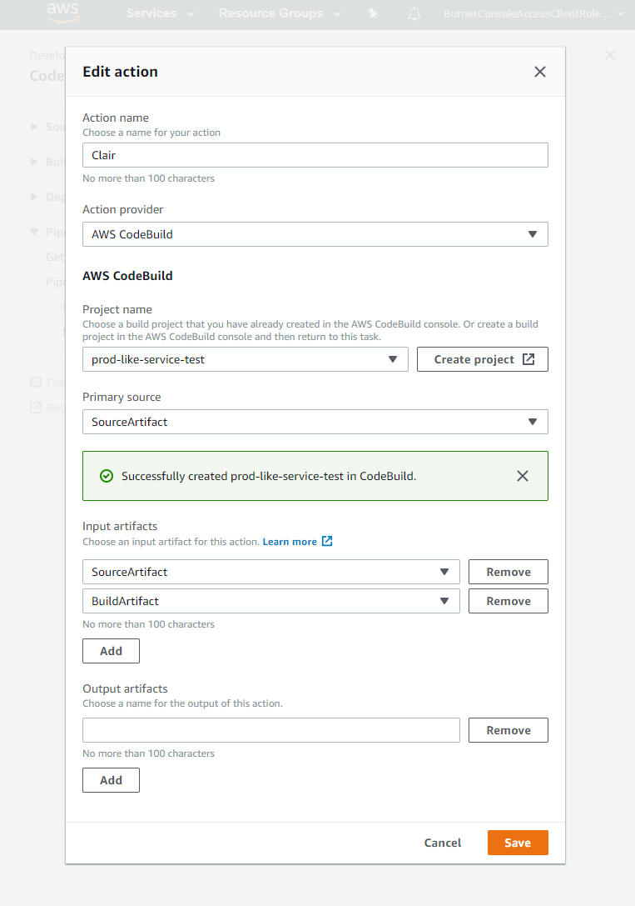
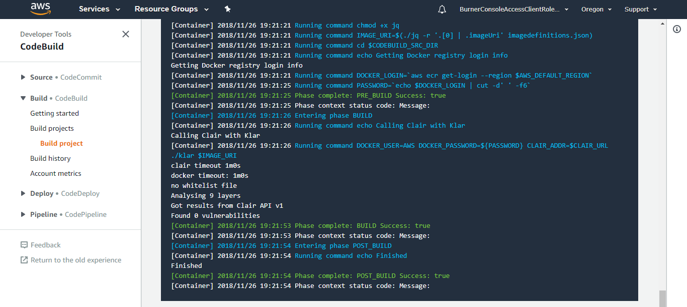

# Mythical Mysfits: DevSecOps with Docker and AWS Fargate

## Lab 4: Implement Container Image scanning

In this lab we will really put the Sec in DevSecOps by including Clair, a static vulnerability scanner for container images. Clair is a service that requires a Postgres DB and a running container. Because we know you already know how to stand up ECS services we've already stood up the Clair service for you in the core.yml CloudFormation template. Now we're going to add another CodeBuild project to run Clair via a tool called Klar, add a test phase to the pipeline we created in Lab 3, then run our CodeBuild project in that test phase. Klar is a wrapper around the Clair APIs that makes it easier to use integration piplines like this one. Check out the [Klar GitHub repo](https://github.com/optiopay/klar)) for more info.

Why would we use Clair? Injecting automated security into the pipeline gives you the same benefit as automated test - the ability to move quickly with confidence that you haven't regressed on security.

Here's what you'll be doing:

* [Create AWS CodeBuild Project](#create-aws-codebuild-project)
* [Create Buildspec and Test the Pipeline](#create-buildspec-and-test-the-pipeline)

### Create AWS CodeBuild Project
1\. Create the new CodeBuild project.

In the AWS Management Console, navigate to the [AWS CodePipeline](https://console.aws.amazon.com/codepipeline/home#/) dashboard. Choose the pipeline you created in Lab 3, which should be named prod-like-service, then choose Edit in the upper right.

We're going to add a new stage, "Test", between the "Build" and "Deploy" stages. Scroll down and choose "Add Stage" between "Build" and "Deploy". Name the stage "Test" then choose "Add stage". Choose "Add action group" inside of our new stage. Name the new action "Clair" and choose CodeBuild from the dropdown. New fields will appear - choose "Create project" similar to what we did in Lab 3. 

- Project Name: Enter `prod-like-service-test`

**Environment:**

- Environment Image: Select **Managed Image** - *There are two options. You can either use a predefined Docker container that is curated by CodeBuild, or you can upload your own if you want to customize dependencies etc. to speed up build time*
- Operating System: Select **Ubuntu** - *This is the OS that will run your build*
- Runtime: Select **Docker** - *Each image has specific versions of software installed. See [Docker Images Provided by AWS CodeBuild](http://docs.aws.amazon.com/codebuild/latest/userguide/build-env-ref-available.html)*
- Runtime version: Select **aws/codebuild/docker:17.09.0** - *This will default to the latest*
- Image version: **Leave as is**
- Privileged: **Leave as is** - *You can't actually change anything here. In order for to run Docker inside a Docker container, you need to have elevated privileges*
- Service role: **Existing service role** - *A service role was automatically created for you via CFN*
- Role name: Choose **CFNStackName-CodeBuildServiceRole** - *Look for the service role that has the name of the CFN stack you created previously*

- Uncheck **Allow AWS CodeBuild to modify this service role so it can be used with this build project**

Expand the **Additional Information** and enter the following in Environment Variables:

- Name: `CLAIR_URL` - *Enter this string*
- Value: ***`REPLACE_ME_LoadBalancerDNS`*** - *This is an output from your CloudFormation stack - LoadBalancerDNS.*

**Buildspec:**

- Build Specification: Select **Use a buildspec file** - *We are going to provide CodeBuild with a buildspec file*
- Buildspec name: Enter `buildspec_clair.yml` - *we'll be using the same repo, but different buildspecs*

Choose **Continue to CodePipeline**.

You will now be back at the CodePipeline console. In the Input Artifacts section we're going to do something different than before - we're going to use multiple artifacts. Select SourceArtifact from the dropdown, then choose add, then choose BuildArtifact. Another dropdown will appear above, Primary Artifact. Select SourceArtifact here. Finally leave your output artifacts empty. What we've done here is inject the source artifact from CodeCommit as well as the build artifact (imagedefinitions.json) from the build phase. The source artifact is our primary input artifact because it's where our buildspec is.

Save the action, choose "Done" to finish editing the stage, then choose "Save" to save the entire pipeline.

### Create Buildspec and Test the Pipeline

1\. Create BuildSpec and Test the Pipeline

Just like in Lab 2 and Lab 3, we're going to create a buildspec for running Clair. See [Build Specification Reference for AWS CodeBuild](http://docs.aws.amazon.com/codebuild/latest/userguide/build-spec-ref.html) for more details on the buildspec format.

Our intern from last summer got started with Clair but didn't finish before she went back to school. Her buildspec is ready to rock, it just needs to get copied into your source repository.

<pre>
$ cd ~/environment/<b><i>REPLACEME_LIKE_REPO_NAME</b></i>
$ git checkout master
$ cp ~/environment/devsecops/Lab-4/hints/buildspec_clair.yml buildspec_clair.yml
</pre>

2\. Check in your new file into the AWS CodeCommit repository.

Make sure the name of the file is buildspec_clair.yml and then run these commands:

<pre>
$ git add buildspec_clair.yml
$ git commit -m "Adding in support for Clair."
$ git push origin master
</pre>

If all goes well, you should see that Clair inspected your image and didn't find anything wrong. Choose "AWS CodeBuild" in the Clair action to go to the CodeBuild project. Inspect the **Build Log** to see if there was a failure. You'll also see these same logs in the CloudWatch Logs console. It make take a few minutes before anything shows up.

From here, any run of the pipeline will include an automated security check to look for CVEs and other vulnerabilities. Congratulations! You've finished the second workshop in this track. If you're heading on to the last workshop in the series, feel free to leave everything as is.

Whether you move on to the next workshop or wrap up here, make sure you [clean everything up](../README.md#workshop-cleanup) when you're done!
